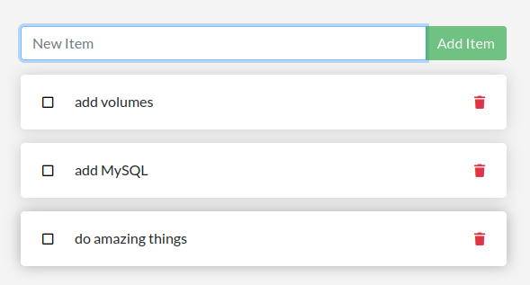

In case you didn't notice, our todo list is being wiped clean every single time we launch the container. Why is this? Let's dive into how the container is working.

## The Container's Filesystem

When a container runs, it uses the various layers from an image for its filesystem. Each container also gets its own "scratch space" to create/update/remove files. Any changes there won't be seen in another container, even if they are using the same image. And any changes in this "scratch space" are deleted when a container is stopped.

## Seeing this in practice

To see this in action, we're going to start two containers and create a file in each. What you'll see is that the files created in one container aren't available in another.

1. Start an Ubuntu container that will create a file named /data.txt with a random number between 1 and 10000.

    ```
    docker run -d --name mycontainer ubuntu bash -c "shuf -i 1-10000 -n 1 -o /data.txt && tail -f /dev/null"
    ```

    In case you're curious about the command:
    
    * '--name mycontainer' explicitely sets a specific name instead of using the funny ones (e.g. clever_maxwell)
    * We are starting a bash shell and invoking two commands (that's why we have the `&&`). The first portion picks a single random number and writes it to `/data.txt`. The second command is simply watching a file to keep the container running.

2. Validate we can see the output by exec'ing into the container. 

    Use the docker exec command to do the same. Normally, you would need to get the container's ID (use docker ps to get it) but since we gave our container a specific name this is much easier

    ```
    docker exec mycontainer cat /data.txt
    ```
    
    You should see a random number!

3. Now start another Ubuntu container (the same image) and we'll see we don't have the same file.

    ```
    docker run --rm -it ubuntu ls /
    ```

    There's no data.txt file in the list! That's because it was written to the scratch space for only the first container.

    Note: 
    * '--rm' instructs Docker to remove the container once it is finished. 
    * '-it' stands for "interactive, allocate pseudo TTY". Which means the container starts, executes the 'ls /' command, shows its output, and then terminates (and is then removed because of the '--rm').

4. Go ahead and remove the first container.

    ```
    docker rm -f mycontainer
    ```

    Again, a lot simpler since it as a defined name!


## Container Volumes

With the previous experiment, we saw that each container starts from the image definition each time it starts. While containers can create, update, and delete files, those changes are lost when the container is removed and all changes are isolated to that container. With volumes, we can change all of this.

[Volumes](https://docs.docker.com/storage/volumes/) provide the ability to connect specific filesystem paths of the container back to the host machine. If a directory in the container is mounted, changes in that directory are also seen on the host machine. If we mount that same directory across container restarts, we'd see the same files.

## Persisting the Todo Data

By default, the todo app stores its data in a [SQLite Database](https://www.sqlite.org/index.html) at /etc/todos/todo.db. If you're not familiar with SQLite, no worries! It is a simple a relational database in which all of the data is stored in a single file. While this isn't the best for large-scale applications, it works for small demos. We'll talk about switching this to a different database engine later.

With the database being a single file, if we can persist that file on the host and make it available to the next container, it should be able to pick up where the last one left off. By creating a volume and attaching (often called "mounting") it to the directory the data is stored in, we can persist the data. As our container writes to the todo db file, it will be persisted to the host in the volume.

As mentioned, we are going to use a named volume. Think of a named volume as simply a bucket of data. Docker maintains the physical location on the disk and you only need to remember the name of the volume. Every time you use the volume, Docker will make sure the correct data is provided.

1. Create a volume by using the docker volume create command.

    ```
    docker volume create todo-db
    ```

2. Stop and remove the todo app container once again (with `docker rm -f <container-id>`), as it is still running without using the persistent volume.

3. Start the todo app container, but add the -v flag to specify a volume mount. We will use the named volume and mount it to /etc/todos, which will capture all files created at the path. This time we also specify a name (todo) for the container.

    ```
    docker run -dp 3000:3000 --name todo -v todo-db:/etc/todos getting-started
    ```

4. Once the container starts up, open the app and add a few items to your todo list.

    

5. Remove the container for the todo app. 

    ```
    docker rm -f todo
    ```

6. Start a new container using the same command from above.

7. Open the app again. You should see your items still in your list!

8. Go ahead and remove the container when you're done checking out your list.

You have now learned how to persist data!

## Diving into our Volume

A lot of people frequently ask "Where is Docker actually storing my data when I use a named volume?" If you want to know, you can use the docker volume inspect command.

```
docker volume inspect todo-db
[
    {
        "CreatedAt": "2022-04-03T12:27:44+02:00",
        "Driver": "local",
        "Labels": {},
        "Mountpoint": "/var/lib/docker/volumes/todo-db/_data",
        "Name": "todo-db",
        "Options": {},
        "Scope": "local"
    }
]
```

The Mountpoint is the actual location on the disk where the data is stored. Note that on most machines, you will need to have root access to access this directory from the host. But, that is where it is!

## Recap

At this point, we have a functioning application that can survive restarts! We can show it off to our investors and hope they can catch our vision!

In the next step, you will learn how to add an external database (MySQL) to the ToDo app to store the data.

---

**Next Step:** [Add MySQL DB, Multi-Container apps](lab4.md) 