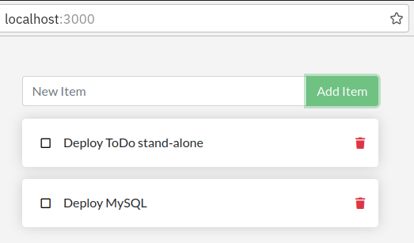
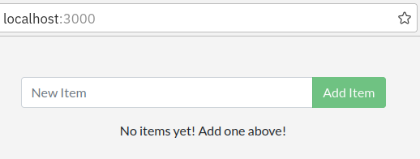

We will use a simple todo list app throughout this workshop. It is written in Node.js.  

At this point, your development team is quite small and you're simply building an app to prove out your MVP (minimum viable product). You want to show how it works and what it's capable of doing without needing to think about how it will work for a large team, multiple developers, etc.



## Get the code

```
git clone https://github.com/Harald-U/docker-101.git
cd docker-101/app
```

## Building the Container Image

> **What is a container image?**
> When running a container, it uses an isolated filesystem. This custom filesystem is provided by a container image. Since the image contains the container's filesystem, it must contain everything needed to run an application - all dependencies, configuration, scripts, binaries, etc. The image also contains other configuration for the container, such as environment variables, a default command to run, and other metadata.

In order to build a container image, we need to use a Dockerfile. A Dockerfile is something like a cooking recipe. It is simply a text-based script of instructions and "ingredients" that are used to package your application into a container image. 

1. Create a file named Dockerfile **in the same folder as the file package.json** with the following contents:

    ```
    FROM node:18-alpine
    WORKDIR /app
    COPY . .
    RUN yarn install --production
    EXPOSE 3000
    CMD ["node", "src/index.js"]
    ```

   > Please check that the file Dockerfile has no file extension like .txt. Some editors may append this file extension automatically and this would result in an error in the next step.

   What do the lines in the Dockerfile mean?

      <dl>
         <dt>FROM</dt>
         <dd>This the base image you are building upon. We want to use an image with Node.js version 18 built on Alpine Linux.</dd>
         <dt>WRKDIR</dt>
         <dd>This will set the working directory within the container image.</dd>  
         <dt>COPY<dt>
         <dd>Copy the source code from your notebook into the container image.</dd>
         <dt>RUN</dt>
         <dd>The RUN command will be executed during the BUILD of the container image. 
         It uses 'yarn' to resolve the Node.js dependencies.</dd>
         <dt>EXPOSE<dt>
         <dd>This makes the port your application is using available so that we can connect to it from outside the container.</dd>
         <dt>CMD</dt>
         <dd>This is the start command of your application, executed when the container is run.</dd>   
      </dl>

2. If you haven't already done so, open a terminal and go to the app directory with the Dockerfile. Now build the container image using the docker build command.

   ```
   docker build -t todo-app .
   ```

   This command used the Dockerfile to build a new container image. You might have noticed that a lot of "layers" were downloaded. This is because we instructed the builder that we wanted to start FROM the node:12-alpine image. But, since we didn't have that on our machine, that image needed to be downloaded.

   After the image was downloaded, we copied in our application and used yarn to install our application's dependencies. The CMD directive specifies the default command to run when starting a container from this image.

   Finally, the -t flag 'tags' our image. Think of this simply as a human-readable name for the final image. Since we named the image 'todo-app', we can refer to that image when we run a container.

   Don't forget the . at the end of the docker build command! It tells that Docker should look for the Dockerfile in the current directory.

## Starting an App Container

Now that we have an image, let's run the application! To do so, we will use the docker run command to start a container based on the container image we just created.

> **What is a container?**
> Simply put, a container is just another process on your machine that has been isolated from all other processes on the host machine. That isolation leverages kernel namespaces and cgroups, features that have been in the Linux kernel for a long time.

1. Start your container using the docker run command and specify the name of the image we just created:

   ```
   docker run -dp 3000:3000 todo-app
   ```

   What are the -d and -p flags?

   <dl>
   <dt>-d</dt>
     <dd>This is a server type application. Run the new container in "detached" mode = in the background.</dd>
   <dt>-p</dt>
     <dd>Map the host's port 3000 to the container's port 3000. Without the port mapping, we wouldn't be able to access the application.</dd>
   </dl>    
   
   Note: the first port number (before the ':') is the host port on your notebook etc. If this port is already taken by another app, you could try another port. 
   
   The second port (after the ':') is the container port. How do we know that the container port is 3000? If you look in file `src/index.js`  you can find this statement:

   ```
   app.listen(3000, () => console.log('Listening on port 3000'));
   ```

   So the ToDo app is listening on port 3000. And in the Dockerfile we specified `EXPOSE 3000` which means we tell Docker the container listens on the specified network port at runtime.


2. After a few seconds, open your web browser to http://localhost:3000. You should see our app!

   

   Go ahead and add an item or two and see that it works as you expect. You can mark items as complete and remove items. Your frontend is successfully storing items in the backend! 

   You can see your running container in Docker Dashboard (Mac, Windows) or via commandline:

   ```
   docker ps
   ```

   Result:

   ```
   CONTAINER ID   IMAGE                    COMMAND                  CREATED          STATUS          PORTS                                       NAMES
   b46846361370   todo-app                 "docker-entrypoint.s…"   6 minutes ago    Up 6 minutes    0.0.0.0:3000->3000/tcp, :::3000->3000/tcp   focused_kepler
   ```

---

**Next Step:** [Update the app, build a new image](lab2.md) 