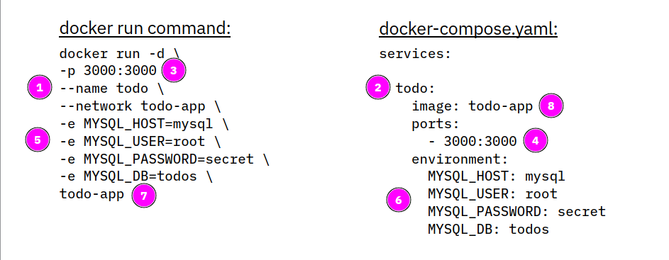
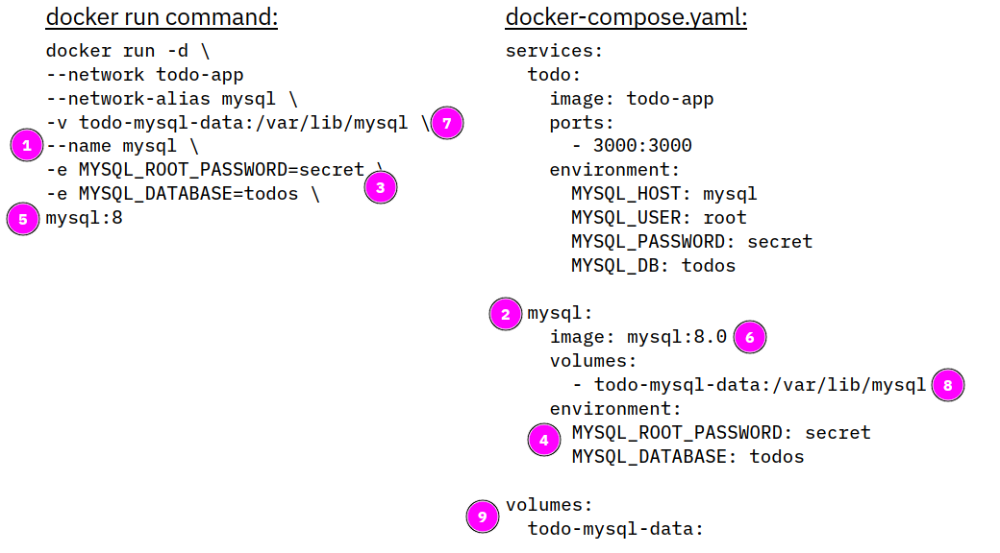

**Docker Compose** is a tool for defining and running multi-container applications (workloads). Compose simplifies the control of your entire application stack, making it easy to manage services, networks, and volumes in a single, comprehensible YAML configuration file. Then, with a single command, you create and start all the services from your configuration file.

The term 'service' is new in the context of this workshop: a service is a building block in a Docker Compose application, it is an abstraction layer over a Docker container. A Docker Compose application is typically made up of more than one service or container.

Docker Compose relies on a YAML configuration file, usually named `docker-compose.yaml`. The `docker-compose.yaml` file follows the rules provided by the [Compose Specification](https://github.com/compose-spec/compose-spec/blob/master/spec.md) in how to define multi-container applications.

Docker Compose is part of Docker Desktop (for Mac, Windows, Linux). If you are using docker-ce on Linux, you may need to install docker-compose manually. refer to your distribution on how to do this.

In our ToDo example in this workshop, using docker-compose actually makes sense:

- We have two containers, ToDo and MySQL, that means we need to create two services
- Both services require environment variables for configuration
- One of the services requires a volume to store data persistent
- We need a network for the services to communicate with each other

Instead of using several commands we can use docker-compose and a single configuration file `docker-compose.yaml`. 

## Structure of docker-compose.yaml

The following picture compares a `docker run`command for the ToDo app on the left with a `docker-compose.yaml`file on the right:



* A container in Docker Compose is called a service, hence the yaml file must begin with the `services:` statement.
* The service name `todo`(2) is equivalent to the `--name` tag in `docker run`, it will provide a name for the running container *.
* The ports of `-p`(3) will go in the `ports:` section (4)
* One or more environment variables (5) will go in the `environment:` section (6)
* The last parameter of the `docker run`command is always the name of the container image (7), this will go into the `image` section (8) 

*) Actually, the name of the service (e.g. todo) will be the network name or alias of the running container. The container name will be a combination of the directory name in which the docker-compose.yaml is located, the service name and a number, e.g. `app-todo-1`. You can specify a specific name for your workload by adding a `name:` statement to docker-compose.yaml as described [here](https://docs.docker.com/compose/compose-file/04-version-and-name/#name-top-level-element).

Now we will add the MySQL container.

Again the `docker run`command for MySQL on the left, on the right we add to the `docker-compose.yaml`:



* `--name`tag (1) will become the name of the service `mysql` (2)
* environment definitions (3) into `environment:` (4)
* image name (5) into `image:` section (6)
* `-v`(7) specified a volume in `docker run`, there is an equivalent `volumes:` section (8)
* Volumes must be defined in `docker-compose.yaml`in a additional `volumes:` section which is on the same YAML level as `services:` (9)

You may have noticed that there is no `network`defined, Docker Compose will automatically create a network for us. Also `network-alias`is not required for MySQL, every service automatically has a unique network name based on its service name, the todo container can connect to the mysql container with its name `mysql`.

You now start the workload with

```
docker-compose up
```

This connad will log all kind of messages to the console.

Docker Compose will pull images as needed, then it will create a network, a volume, and two containers:

```
✔ Network app_default           Created
✔ Volume "app_todo-mysql-data"  Created  
✔ Container app-todo-1          Created 
✔ Container app-mysql-1         Created
```

You can check with `docker network ls` that there is really a network called `app_default`, and with `docker volume ls` if the volume exists.

## Dependencies

If for some reason the creation of the mysql service takes longer than the creation of the todo service (for example because of an initial pull of the MySQL image), the todo service will fail:

```
todo-1   | Waiting for mysql:3306............
todo-1   | Timeout
todo-1   | Error: connect ECONNREFUSED 172.21.0.3:3306
```

In this example log the ToDo app tried to connect to MySQL but the mysql service was not fully started. To prevent this you can create dependencies in the `docker-compose.yaml` by adding a `depends_on` statement to the todo service definition:

```
name: docker101

services:
  todo:
    image: todo-app
    depends_on: 
      - mysql
    ports:
      - 3000:3000
    environment:
      MYSQL_HOST: mysql
      MYSQL_USER: root
      MYSQL_PASSWORD: secret
      MYSQL_DB: todos

  mysql:
    image: mysql:8.0
    volumes:
      - todo-mysql-data:/var/lib/mysql
    environment: 
      MYSQL_ROOT_PASSWORD: secret
      MYSQL_DATABASE: todos

volumes:
  todo-mysql-data:
```

With this definition added, the mysql service will start first and then the todo service. Mission accomplished.

## Starting and Stopping

If you started your workload with `docker-compose up`, you will see all output of Compose and the containers in the shell. You can stop the workload with `Ctl-c` or `Cmd-c`. This will result in stopped containers (check with `docker ps -a`).

You can remove the stopped containers with:

```
docker-compose rm
```

You can start your workload **daemonized** in the background using

```
docker-compose up -d
```

This will show two containers starting:

```
✔ Container app-mysql-1  Started
✔ Container app-todo-1 
```

To stop the workload, issue this command:

```
docker-compose down
```

This will stop and remove the containers **and** remove the network, too. Of course, the volume isn't removed! 

To see the logs of your containers, enter:

```
docker-compose logs [-f]
```

The optional `-f` (= follow) allows the log viewer to remain open and 'follow' the log messages as they come in. 


## Building container images

Docker Compose can also build container images. Simply add a `build:` statement to `docker-compose.yaml`. Here is example for the ToDo app, this assumes that the `Dockerfile` is in the same directory as `docker-compose.yaml`:

```
name: docker101

services:
  todo:
    build: .
    image: todo-app
    depends_on: 
      - mysql
    ports:
      - 3000:3000
    environment:
      MYSQL_HOST: mysql
      MYSQL_USER: root
      MYSQL_PASSWORD: secret
      MYSQL_DB: todos

  mysql:
    image: mysql:8.0
    volumes:
      - todo-mysql-data:/var/lib/mysql
    environment: 
      MYSQL_ROOT_PASSWORD: secret
      MYSQL_DATABASE: todos

volumes:
  todo-mysql-data:
```

Note the '.' in the `build:` statement, this is the same period you would use at the end of a `docker build` command.

You can now either run a build by itself with:

```
docker-compose build
```

or include a build in the startup if required with:

```
docker-compose up --build
```

## Environment variables

In the above example we specified the environment variables directly in the docker-compose.yaml. It is preferable to 'externalize' the configuration (12 Factors!) and this is very easy with Docker Compose. 

It is common practice to specify environment variables in file that is typically called `.env` (and spelled "Dotenv"). For probably every programming language there are libraries/extensions that automatically read a .env file if it is present, in Python it is called 'python-dotenv'. A .env file for our example would look like this:

```
MYSQL_HOST: mysql
MYSQL_USER: root
MYSQL_PASSWORD: secret
MYSQL_DB: todos
MYSQL_ROOT_PASSWORD: secret
MYSQL_DATABASE: todos
```

Notice that MYSQL_PASSWORD and MYSQL_ROOT_PASSWORD as well as MYSQL_DB and MYSQL_DATABASE are duplicates. We could shorten the .env to:

```
MYSQL_HOST: mysql
MYSQL_USER: root
MYSQL_PASSWORD: secret
MYSQL_DB: todos
```

The .env file should be in the same directory as the docker-compose.yaml file. The docker-compose.yaml is then adapted to use the .env file:

```
name: docker101

services:
  todo:
    build: .
    image: todo-app
    depends_on: 
      - mysql
    ports:
      - 3000:3000
    environment:
      MYSQL_HOST: ${MYSQL_HOST}
      MYSQL_USER: ${MYSQL_USER}
      MYSQL_PASSWORD: ${MYSQL_PASSWORD}
      MYSQL_DB: ${MYSQL_DB}

  mysql:
    image: mysql:8.0
    volumes:
      - todo-mysql-data:/var/lib/mysql
    environment: 
      MYSQL_ROOT_PASSWORD: ${MYSQL_PASSWORD}
      MYSQL_DATABASE: ${MYSQL_DB}

volumes:
  todo-mysql-data:
```

When you issue a `docker-compose up` the .env is automatically read and the placeholders in the docker-compose.yaml are replaced with the values of variables in .env.

There are more possibilities with environement variables and .env files in the [Docker documentation](https://docs.docker.com/compose/environment-variables/set-environment-variables/).

----
**Congratulations!** This concludes the workshop! You may want to have a look at the last topic:

**Last Topic:** [Tips and useful commands](lab7.md) 