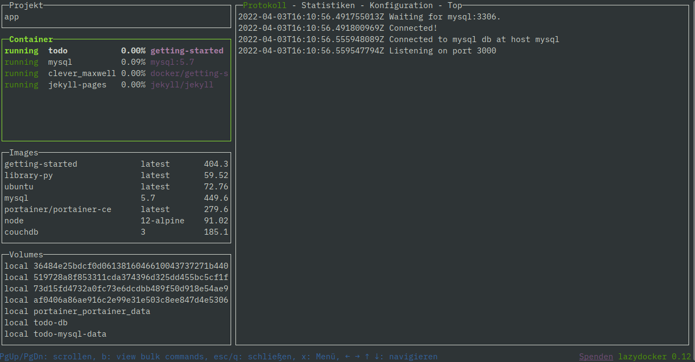

## Commands

Here are some additional very useful commands.

### Images

List all images downloaded from Docker Hub (or other repositories) and created by `docker build` locally:

```
docker image ls
```

If you are busy making changes to your application and rebuilding images, you may get "dangling images":

```
REPOSITORY                    TAG            IMAGE ID       CREATED          SIZE
todo-app                      latest         72b0060cd278   18 minutes ago   404MB
<none>                        <none>         8c27584a6af2   19 minutes ago   458MB
<none>                        <none>         aeecef657347   20 minutes ago   458MB
<none>                        <none>         f78b96b14576   6 hours ago      456MB
<none>                        <none>         a3381a63e121   7 hours ago      456MB
<none>                        <none>         a75fc08aebfa   24 hours ago     456MB
```

Name and Tag of dangling images are `<none>`. To get rid of them from time to time simply run:

```
docker image prune
```

You can get rid of specific container image using:

```
docker image rm <IMAGE ID>
```

If the image is used by a container, Docker will not remove it.

### Networks

In Lab 4 ('Add MySQL DB, Multi-Container apps') we added a Docker network. To display all networks, use:

```
docker network ls
```

To delete a specific network (e.g. the todo-app network from Lab 4), issue:

```
docker network rm todo-app
```

### Volumes

And, very similar, for volumes:

```
docker volume ls
```

Delete a specific volume:

```
docker volume rm <volume name>
```

To get rid of all unused volumes:

```
docker volume prune
```


## Tools

And here is a useful tool, specifically for Linux users since there is no graphical Docker Desktop but it works on Mac and Windows, too. It is called Lazydocker.

You can find more information about it [here](https://github.com/jesseduffield/lazydocker/blob/master/README.md){:target="_blank"}.



There are other, similar tools, e.g. [Portainer](https://github.com/portainer/portainer){:target="_blank"}.